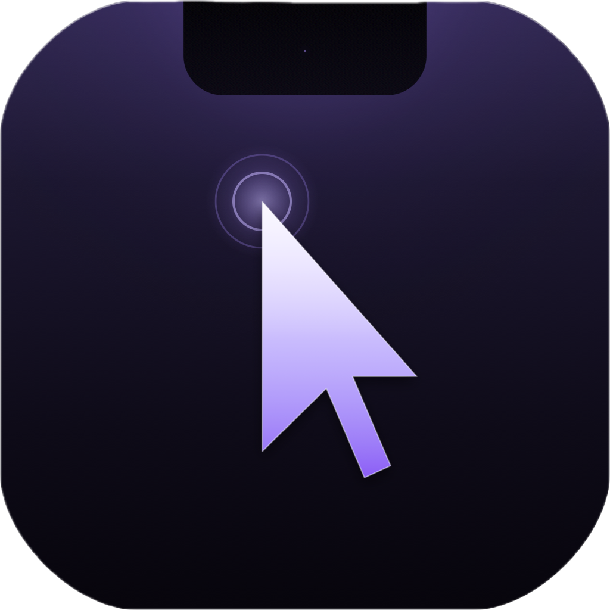

<p align="center">
  <a href="https://cwlee0911.github.io/NotchClick/">
    
  </a>
</p>

<h1 align="center">NotchClick</h1>

<p align="center">
  Turn your MacBook notch into a fast control panel.
</p>

<p align="center">
  <a href="https://cwlee0911.github.io/NotchClick/">
    
  </a>
</p>

---

## Overview

NotchClick turns the top-center notch area into a compact panel for the things you reach for all day:

| Feature | What it does |
| --- | --- |
| 🚀 Launcher | Pin favorite apps and open them directly from the notch. |
|  Music | Control Apple Music or Spotify without switching context. |
| 🧩 Menu bar helper | Open the panel, settings, or quit from a small status item. |

The panel appears when you click the notch target, then folds away when you move on.

## Download

Download the latest DMG from the website:

```text
https://cwlee0911.github.io/NotchClick/downloads/NotchClick.dmg
